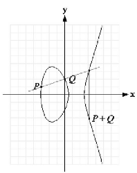
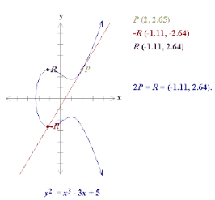
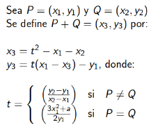

Como ya mencionamos una curva elíptica sobre un cuerpo finito está formada por un conjunto finito de puntos.

Analizando el siguiente gráfico:

* Hay simetría horizontal.
* Nótese que tiene 31 puntos.
* El número de puntos de la curva no es siempre primo, por lo que se elige un subgrupo cíclico suficientemente
grande.

## Aritmétrica Geométrica

* El opuesto (negativo) de un punto P= (x, y) es su simétrico respecto al eje x : ‒P= (x, ‒y).

> Para sumar P y ―P lo anterior no funciona ya que la línea que los une no corta a la curva en otro punto. Para evitar este problema se añade un punto del infinito que se designa por O, y por definición se dice que P+(‒P)=O (y por tanto P + O = P).

* Para sumar dos puntos P, Q (con P≠‒Q ) se traza una línea que los une, que corta a la curva en otro punto R; entonces P+Q = ‒R.

* Para sumar P consigo mismo se traza la tangente en P, que corta a la curva en otro punto ‒ R; entonces 2P = P + P = R.

> Caso especial:
Si P= (x, 0) entonces la tangente es vertical y no corta de nuevo a la curva. Entonces se establece que 2P = O.

> NOTA:
Debemos evitar las curvas con singularidades (tangente no es posible cuando discriminante = 0)

## El cálculo de la suma:

* es posible deducir fórmulas para calcular la suma
* ellas dependerán de la característica del cuerpo K.

Por ejemplo:

- Si y^2 = (x^3+ ax + b), con 4a^3+ 27b^2 != 0 mod  p

- Si y^2+cy= (x^3 + ax + b), con c != 0 mod 2^m

[back to the homepage]({{ site.baseurl }}).
