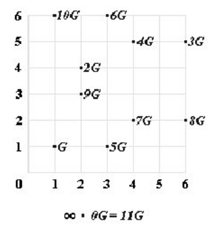

## Elliptic curve Diffie–Hellman (ECDH)

### Parámetros del dominio:

Nuestros algoritmos de curva elíptica funcionarán en un subgrupo cíclico de una curva elíptica sobre un campo finito. Por lo tanto, nuestros algoritmos necesitarán los siguientes parámetros:

* El primo p que especifica el tamaño del campo finito.
* Los coeficientes a y  De la ecuación de la curva elíptica.
* El punto base G que genera nuestro subgrupo.
* La orden n del subgrupo.
* El cofactor h del subgrupo.

En conclusión, los parámetros de dominio para nuestros algoritmos son el sextuplo (p, a, b, G, n, h)
.

### Algoritmo:

Diffie-Hellman: protocolo para intercambio de claves.

Sea E una curva elı́ptica con G un generador de un subgrupo cı́clico de orden prima p.

* La clave privada es un entero aleatorio X elegido de {1, ..., n-1} (donde n es el orden del subgrupo).
* La clave pública es el punto Y = X.G (Donde G es el punto base del subgrupo).

Si sabemos **Y** y **G** (junto con los otros parámetros del dominio), encontrar Y es "fácil". Pero si conocemos Y y G, encontrar la clave privada X es "difícil", porque nos obliga a resolver el problema del logaritmo discreto.

* Alice elige un entero secreto XA ; Bob elige XB
* Las claves públicas correspondientes son
  - YA = xA · G
  - YB = xB · G
* La clave compartida es
  - K = xA · xB · G
  - Alice calcula K = xA · YB
  - Bob calcula K = xB · YA

### Ejemplo:

Si tenemos la curva:

> y^2 = x^3 +x - 1, sobre Z7,con G=(1,1)

* Alice elige xA = 4; calcula YA = 4 · G = (4,5)
* Bob elige xB = 9; calcula YB = 9 · G = (2,3)

* Alice calcula K = xA · YB = 4 · (2,3) = (6,5)
* Bob calcula K = xB · YA = 9 · (4,5) = (6,5)

* K = xA · xB · G = 4 · 9 · G = (36 mod 11) · G =
* K = 3 · G = (6,5) = (Kenc,Kmac)

### Key encrypion y key  MAC
> El cifrado proporciona confidencialidad, un MAC proporciona integridad. El uso de cifrado solo hace que sus mensajes sean vulnerables a un ataque de texto cifrado.

* Confidencialidad:  Es la protección de datos y de información intercambiada entre un emisor y uno o más destinatarios frente a terceros. Esto debe hacerse independientemente de la seguridad del sistema de comunicación utilizado, de hecho un asunto de interés es el problema de garantizar la Confidencialidad de la comunicación utilizada cuando el sistema es inseguro.

* Integridad: Es la propiedad que busca mantener los datos libres de modificaciones no autorizadas. La violación de la Integridad se presenta cuando un empleado, programa o proceso por accidente o con mala intención, modifica o borra los datos importantes que son parte de la información, así mismo hace que su contenido permanezca inalterado a menos que sea modificado por el personal autorizado; y esta modificación será registrada, asegurando su precisión y confiabilidad.

> El problema de Diffie-Hellman para las curvas elípticas se supone que es un problema "duro". Se cree que es tan "difícil" como el problema del logaritmo discreto, aunque no hay pruebas matemáticas disponibles. Lo que podemos afirmar con seguridad es que no puede ser "más difícil", porque resolver el problema del logaritmo es una forma de resolver el problema de Diffie-Hellman.
