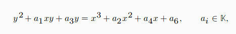
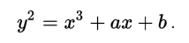

En los **sistemas de criptografía asimétrica** se utiliza 2 tipos de claves, las cuales son: la clave pública y la clave privada. En la cual mediante conceptos matemáticos podemos tener la certeza que conseguir la clave privada en cada unas de la partes(cifrado y descifrado) no sean fáciles de calcular conociéndose la clave pública.

Este tipo de sistemas nos ayudan a encontrar solución a ciertos problemas matemáticos, como puede ser la realización de tests de primalidad, la factorización de números enteros, la demostración del último teorema de Fermat o el logaritmo discreto, donde g e y son elementos de un grupo cíclico finito G, y x la solución a la ecuación g^x = y <=> x = logy, este puede ser un problema de complejidad exponencial para ciertos grupos finitos de gran tamaño, sin embargo el problema inverso, puede ser resuelto mediante exponenciación discreta.

Un criptosistema basado en curva elíptica puede lograr:
* menores longitudes de las claves
    * mayor rapidez de calculo
    * menos memoria y ahorro en transferencia de los datos
* con seguridad equivalente
* cuando se compara con criptosistemas clásicos, como el RSA

### Tamaño de las claves

### Curva elíptica

Una curva elíptica sobre un cuerpo *K* es una curva algebraica sin puntos singulares que viene dada por una ecuación del tipo:

denominada ecuación general de Weierstrass.

Una curva elíptica E(K) es:
* el conjunto de puntos que satisfacen la ecuación
* mas un punto O en el infinito

Según la característica del cuerpo K, usamos transformaciones lineales para simplificar la ecuación, sin embargo la curva elíptica es una curva plana definida por una ecuación de la forma:

Con el conjunto de puntos G que forman la curva (i.e., todas las soluciones de la ecuación más un punto O, llamado punto en el infinito) más una operación aditiva +, se forma un grupo abeliano. Si las coordenadas x e y se escogen desde un cuerpo finito, entonces estamos en presencia de un grupo abeliano finito. El problema del logaritmo discreto sobre este conjunto de puntos (PLDCE) se cree que es más difícil de resolver que el correspondiente a los cuerpos finitos (PLD). De esta manera, las longitudes de claves en criptografía de curva elíptica pueden ser más cortas con un nivel de seguridad comparable.

### Curvas Aleatorias
A pesar de que las curva elíptica sea un buena elección de seguridad debemos saber elegir bien que curva utilizar para realizar nuestra encriptación, puesto que hay algunas clases de curva elípticas que son particularmente débiles. Por ejemplo, todas las curvas que tienen p = h*n (es decir, el orden del campo finito es igual al orden de la curva elíptica) son vulnerables a un ataque de Smart , que puede ser utilizado para resolver logaritmos discretos en tiempo polinómico en un ordenador clásico.

Ahora bien si queremos implementar el algoritmo en un sistema como convecemos al cliente que la curva es segura y que no es vulnerable ni siquiera por nosotros mismo. En un intento de resolver este tipo de problema, a veces tenemos un parámetro de dominio adicional: la semilla S . Este es un número aleatorio utilizado para generar los coeficientes de **"a"** y **"b"** , o el punto base **"G"** , o ambos. Estos parámetros se generan calculando el hash de la semilla S. Hashes, como sabemos, son "fáciles" de calcular, pero "duro" para invertir.

[back to the homepage]({{ site.baseurl }}).
